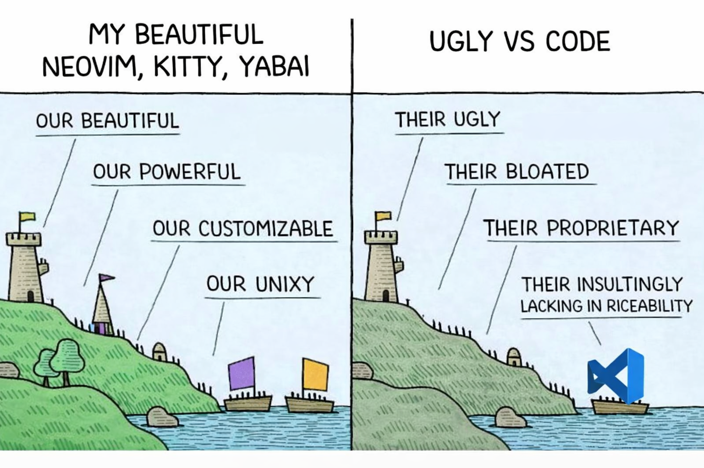

# Dotfiles



My dotfiles managed with [GNU Stow](https://www.gnu.org/software/stow/).

## Structure

```
dotfiles/
├── yabai/      → ~/.yabairc (window manager)
├── skhd/       → ~/.skhdrc (hotkey daemon)
├── nvim/       → ~/.config/nvim (editor)
├── kitty/      → ~/.config/kitty (terminal)
├── tmux/       → ~/.tmux.conf (terminal multiplexer)
└── zsh/        → ~/.zshrc, ~/.zprofile (shell)
```

## Installation

### Prerequisites

Install GNU Stow:

```bash
brew install stow
```

```bash
cd ~/personal/dotfiles
./install.sh
```

Or stow individual packages:

```bash
stow nvim    # Only nvim config
stow zsh     # Only zsh config
```

### Uninstalling

To remove symlinks for a package:

```bash
stow -D nvim
```

## Adding New Configs

1. Create a new directory: `mkdir newapp`
2. Mirror the home directory structure inside it
3. Move your config: `mv ~/.newapprc newapp/.newapprc`
4. Stow it: `stow newapp`

## Updating Changes

Since Stow creates symlinks, edits to files in this repo are automatically reflected in your home directory.

**For shell configs (zsh):**
```bash
source ~/.zshrc
```

**For apps that need restart:**
- **kitty**: Close and reopen terminal
- **yabai**: `yabai --restart-service`
- **skhd**: `skhd --restart-service`
- **nvim**: Reopen Neovim

**If you added new files to an existing package:**
```bash
stow -R zsh  # Re-stow to pick up new files
```